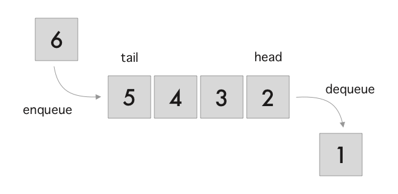

# Queues

## Overview
Queues are an easy to use data structure that allows us to put things in a first in first out manner. A good example of this is how a line (called a queue in England) works. When in a line at the grocery store, the first person in is also going to be the first person out. 

## Advantages
Queues are sometimes the perfect data structure for certain applications. They can handle large amounts of data efficiently.

## Disadvantages
Queues are not a good data structure to use if getting data from the middle of the queue is necessary. In these cases other data structures such as arrays or dictionaries may be better fits.

## Example 1
Below is a simple example of how a queue can work in Python. Queue is a module that is built into Python which helps us implement useful functions.
    
    from queue import Queue
     
    my_queue = Queue()
    
    my_queue.put(123)
    
    my_queue.put(124)
    
    print(my_queue.get())
    print(my_queue.get())

    Output:
    123
    124

Notice the order of our output. It is in the order of first in first out.

##Example 2:
Estimated wait time:
One of the problems that faces cutomers of restaurants is knowing when their food is going to be ready. It would be great if there was a simple solution to this problem! Imagine you work for the app development team at your favorite restaurant and you are tasked with coding a solution to this problem. It needs to take orders and queue them up and give an estimated time on when their order wil be ready. This assumes the average time to prepare each order is 1 minute.
This code is a soultion to the above problem:

## Sample Code:

    from queue import Queue
    
    def main():
        my_orders = Queue()
        answer = 0
        while my_orders.qsize() <= 100:
            answer = input("Would you like to order or pickup? 1 to order 2 to pickup: ")
            if answer == 1:
                my_orders.put(order_number)
                order_number += 1
                print("Your order has been added to the queue! ")
                print("The estimated time is " + str(my_orders.qsize()) + " minutes!")
            elif answer == 2:
                my_orders.get()
    main()

## Challenge:
Imagine that you are talking to the manager of a restaurant. They are lamenting that it is difficult to keep track of which order number is which as they are all handwritten and numbers are often lost. The kitchen would love to be able to have an automated system that simply puts the customer name onto a screen so that customers can get their food. What luck! You just got a job as a software developer! :) Write a program that takes customer names and displays (prints in this case) customer names when the order is ready. You can assume that the kitchen finishes the orders in order of when they came in. For this exercise, you can simply write a function that takes user input that allows the user to say when someone is ready to pickup.

### Stretch:
Have the program keep track of the time in which orders are ready.

## Example Code:

    from queue import Queue
    def main():
        my_orders = Queue()
        answer = ""
        while True:
            answer = input("Would you like to order? (Y/N)")
            order_status = input("Has the kitchen finished an order? (Y/N) ")
            if order_status == "Y" and my_orders.empty() == False:
                print(str(my_orders.get()) + "'s order is ready!")
            else:
                print("No order in queue!")
            if answer == "Y":
                name = input("What is your name? ")
                my_orders.put(name)
                print("Your food will be out shortly!")
            elif answer == "N":
                print("Have a great day!")
    main()