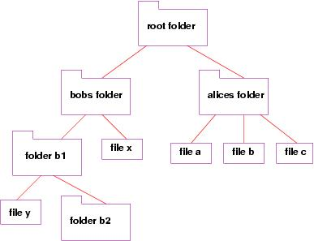

# Queues

## Overview
Trees are a data structure that allows us to store data in a hierarchical order. This is useful for a number of applications. A useful example of why we would ever use this data structure is when we are creating a filing system in a computer. One folder may contain multiple other folders each of which contains their own items. This is an example of an application where a linear data structure (such as a queue or list) would not be the right one to use.

## Advantages
Trees are useful for applications where relationships are important. 

## Disadvantages
Trees can get complex and making quick changes down the line can be difficult.
##Example 1
Below is a simple example of how we can add nodes to a tree. Nodes are simply the files in a filing system. This example below is suplemented by code from tutorialspoint

    class Node:
       def __init__(self, data):
          self.left = None
          self.right = None
          self.data = data
       def insert(self, data):
          if self.data:
             if data < self.data:
                if self.left is None:
                   self.left = Node(data)
                else:
                   self.left.insert(data)
             else:
                if self.right is None:
                   self.right = Node(data)
                else:
                   self.right.insert(data)
          else:
             self.data = data
       def PrintTree(self):
          if self.left:
             self.left.PrintTree()
          print( self.data),
          if self.right:
             self.right.PrintTree()
       def traverse(self, root):
          res = []
          if root:
             res = self.traverse(root.left)
             res.append(root.data)
             res = res + self.traverse(root.right)
          return res
    root = Node(27)
    root.insert(12)
    root.insert(10)
    root.insert(16)
    root.insert(17)
    root.insert(37)
    root.insert(56)
    print(root.traverse(root))  

Notice that there is a lot of code. There are third party modules that allow for easier tree creation. The main thing to notice is that we are able to create a root which all other nodes stem from then we can insert nodes into our tree. We can then write a function to traverse this tree as seen above. 

## Example 2:
Create an algorithm for traversing a Binary Tree and adding up all the values of the nodes.

## Sample Code:

    class Node: 
        def __init__(self, key): 
            self.key = key
            self.left = None
            self.right = None
             
    def sumBinaryTree(root): 
        #this handles case of tree not being populated
        if (root == None):
            return 0
        else:
    
            return (root.key + sumBinaryTree(root.left) +
                           sumBinaryTree(root.right)) 
    def main():
        root = Node(1) 
        root.left = Node(2) 
        root.right = Node(3) 
        root.left.left = Node(4) 
        root.left.right = Node(5) 
        root.right.right = Node(7)
        sum = sumBinaryTree(root) 
     
        print(sum)
    main()

## Challenge:
Create an algorithm that searches for the lowest number in the given BST. Hint: This is easier than it may seem. Remember to look up the definition of a BST. You can presume that the BST is a valid BST.

Stretch:
Find the nth lowest number in the BST

## Example Code:

    class Node: 
        def __init__(self, value): 
            self.value = value
            self.left = None
            self.right = None
             
    def findMin(root): 
        current_node = root
        if current_node.left == None:
            return current_node.value
        return findMin(current_node.left)
    
    def main():
        root = Node(7) 
        root.left = Node(6) 
        root.right = Node(8) 
        root.left.left = Node(3) 
        root.left.right = Node(7) 
        root.left.left = Node(2)
        print(findMin(root))
    main()